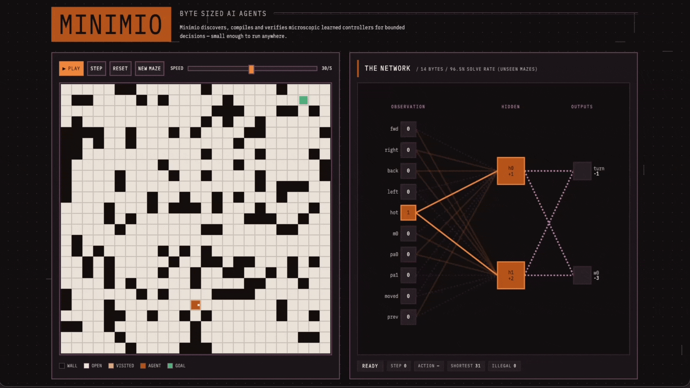

# Summary

> This write-up is being actively expanded (Work In Progress).

[Link to the Maze Solver]()

> This maze solver was intended as a weekend project where I naively thought I could implement a maze-solving neural network in a weekend, that could solve 100% of unseen mazes. How wrong I was.

## Watch a 14 Byte Neural Network Solve a Maze

## Watch a 178 Byte State Machine Classify Lexical Tokens

