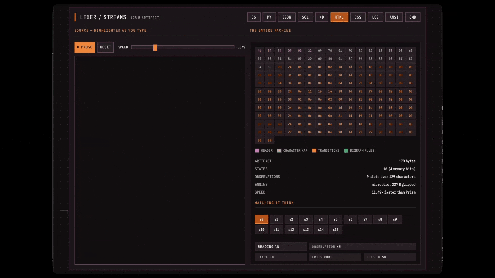

# Summary

> [!WARNING]
> This write-up is an active work in progress. Some benchmarks and claims are changing as I continue to revisit the project. My speed of experimentation outpaced my speed of understanding.
>
> This is the public write-up for a private repository, so some of the content is intentionally vague or incomplete. If you have questions, please reach out to me directly.

[Link to the Maze Solver]()

> This maze solver was intended as a weekend project where I naively thought I could implement a maze-solving neural network in a weekend, that could solve 100% of unseen mazes. How wrong I was.

## Watch a 14 Byte Neural Network Solve a Maze

## Watch a 178 Byte State Machine Classify Lexical Tokens

